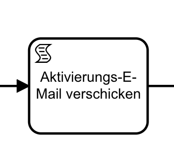
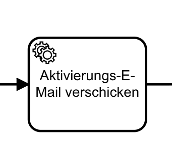
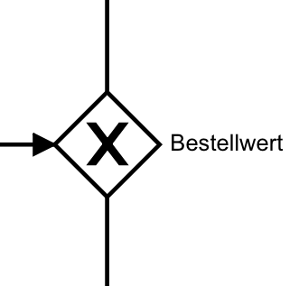
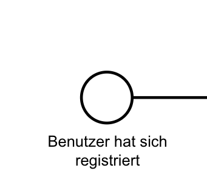

# Getting Started

> Hinweis: Die Texte in Zitatblöcken sind die TODOs des betreffenden Abschnitts.

ProcessEngine und BPMN Studio bilden eine verteilte, quelloffene Laufzeit- und Entwicklungsumgebung für BPMN-basierte Geschäftsprozesse.


## BPMN Studio und die ProcessEngine

> - Einführung BPMN Studio
> - Erklären, was passiert („es startet eine ProcessEngine“)

ProcessEngine.io ist die Workflow-Engine von [5Minds](https://5minds.de).

Im Gegensatz zu vielen anderen Lösungen in diesem Bereich ist ProcessEngine quelloffen und bietet mit BPMN Studio eine integrierte Entwicklungsumgebung zum grafischen Entwerfen **und** Ausführen von Prozessen.

ProcessEngine.io unterstützt somit eine zielgerichtete, iterative Entwicklung und Sie können sich auf das konzentrieren, was zählt: **Ihr Business und Ihre Nutzer.**


Mit BPMN Studio kann der Benutzer nicht nur Prozesse durchdenken, entwerfen und validieren, sondern sie auch direkt in BPMN Studio ausführen.
BPMN Studio bringt hierzu eine integrierte ProcessEngine mit, welche es jedem ermöglicht, seine Prozesse auch ohne Serverlandschaft auszuführen.

Wenn BPMN Studio startet, startet sich auch eine ProcessEngine, ohne, dass der Benutzer hierzu etwas tun muss.


## Das "Hello World" der digitalen Transformation

> - Beispiel-Prozess
> - Code-Beispiele
> - hier bewusst noch keine Erklärung der Elemente - im Vordergrund steht der schnelle Zugang zu den Grundideen und zum Code

Viele Einführungstexte zu Programmiersprachen und anderen IT-Themen enthalten ein sog. "Hello World", ein bewusst einfach gehaltenes Beispiel, welches die jeweilige Technologie in ihren Grundzügen präsentiert.

Das könnte für die Verwendung von ProcessEngine.io in JavaScript folgendermaßen aussehen.


```javascript
// TODO: ACHTUNG: Pseudo-Code! Bitte überarbeiten und diesen Kommentar entfernen!
const client = new ProcessEngineClient('http://localhost:8000');
const result = await client.startProcessInstance("myProcessId", "myStartEventId");
```

Doch die Prozesse im eigenen Unternehmen sind natürlich mehr als ein Start-Aufruf.
Um die ProcessEngine und ihre Vorzüge besser darstellen zu können, wollen wir ein Beispiel aus dem Bereich E-Commerce aufgreifen:

**Der Online-Shop**

In einem Online-Shop sollen Nutzer im Rahmen der Registrierung einen Rabattcode erhalten.
Nutzer, die besonders viel bestellen, sollen zudem einen sog. Reseller-Code erhalten, der ihnen ermöglicht besondere Mengen-Rabatte zu aktivieren.

Üblicherweise werden diese Regeln in vielen, vielen E-Mails und Gesprächen kommuniziert, bevor sie dann im Programmcode niedergeschrieben werden.
Regelmäßig scheinen einige der Anforderungen sich zu widersprechen, so dass Techniker und Nicht-Techniker in einen intensiven Dialog treten müssen, um herauszufinden, wo sich "Wunsch und Wirklichkeit" unterscheiden.

Die Lösung ist, sich gemeinsam ein Bild zu machen.

Nehmen Sie folgende Kette an Anforderungen aus einer E-Mail-Konversation:

* Wir müssen bei der Registrierung auch einen Aktivierungscode verschicken, mit dem User ihre E-Mail-Adresse aktivieren.
* Dann sollten Benutzer, die sich bei ihrem ersten Einkauf registriert haben, noch einen Rabattcode über 10% des Warenwerts, aber jeder Nutzer einen Code über mindestens 10,00 EUR bekommen.
* Falls Benutzer sich während der Bestellung erstmalig registriert haben, dann muss geguckt werden, ob sie Waren im Wert von über 1.000 EUR bestellt haben. Dann sollen sie auch einen Resellercode angeboten bekommen, zusätzlich zum Rabattcode.
* Reseller, die so viel bestellen, dürfen natürlich keinen 10%-Rabattcode kriegen
* Reseller, die sogar über 10.000 EUR bestellen, sollten natürlich trotzdem einen Rabattcode bekommen (aber nur für 5%). Aber die E-Mail dafür darf erst nach der für den Reseller-Code rausgehen!

Nach Erstellen des Prozessdiagramms sehen wir, dass die scheinbar widersprüchlichen Anforderungen weniger konfus sind als gedacht:


Eine Workflow-Engine ermöglicht, diese Diagramme direkt auszuführen und so zum einen die Abläufe mit allen im Team zu diskutieren (insbesondere den Fachexperten, die nicht zwingenderweise Techniker sind!) sowie Unterschiede zwischen der Dokumentation und dem Programmcode zu vermeiden.

Die Steuerung des Diagramms aus einem Skript heraus ist denkbar einfach:

```javascript
// TODO: ACHTUNG: Pseudo-Code! Bitte überarbeiten und diesen Kommentar entfernen!
const client = new ProcessEngineClient('http://localhost:8000', optionalIdentity);
// und ProcessEngineAdminClient

const result = await client.startProcessInstance(PROCESS_MODEL_ID, START_EVENT_ID, END_EVENT_ID);

// TODO: ACHTUNG: Pseudo-Code! Bitte überarbeiten und diesen Kommentar entfernen!
client.subscribeExternalTaskWorker(TOPIC, async (externalTask) => {
    let result = await doSomeLongWork();

    let externalTaskFinished = new ExternalTaskFinished(externalTask.id, result);

    return externalTaskFinished;
  }
);

```

> Hinweis: Mit Abschluss dieses Abschnitts sollte der Leser die Domäne von ProcessEngine/Studio verstanden haben.
> Die folgenden Abschnitte dienen der Vollständigkeit und tieferen Darstellung der Domäne.
> **Alles wirklich notwendige sollte aber bis hierhin bereits angeführt worden sein.**

## Prozesse modellieren

### Was ist BPMN?

BPMN (Business Process Model and Notation) ist eine XML-basierte, ausführbare Modellierungssprache für Geschäftsprozesse.

Sie wurde in der Version 2.0 in [ISO/IEC 19510:2013](https://www.iso.org/standard/62652.html) standardisiert.

Die Verwendung von BPMN zur Beschreibung von Abläufen in Software ist konsequent, weil auf diese Weise

* Diagramme als ausführbare Software gesehen werden,
* die Dokumentation der Software entspricht und
* eine einfachere und verbesserte Kommunikation zwischen Teams sowie Technikern und Nicht-Technikern erreicht wird.


### BPMN: Welche Elemente nutze ich für was?

#### Tasks

##### Script-Task



Ein **Script-Task** führt ein Skript aus.
Das Skript ist als Eigenschaft des Tasks definiert und kann mit BPMN Studio bearbeitet werden.
Diese Art Task eignet sich gut, um erste Prototypen größerer Features zu implementieren.

##### Service-Task



Ein **Service-Task** führt einen externen Service aus.
Diese Art Task eignet sich gut, um Aufgaben an Microservices zu delegieren, wobei die Aufgaben-Delegation in REST-API-Endpunkte und External-Task-Worker unterschieden werden kann.

#### Gateways

##### XOR-Gateway



XOR-Gateways bilden Exclusik-Oder-Verzweigungen, bei denen genau ein Pfad auf Basis der am Gateway notierten Bedingung gewählt und dann abgelaufen wird.
Es gibt weitere Arten von Gateways, um bspw. parallel auszuführende Workflows zu beschreiben.

#### Event

##### Start-Event



Jeder Prozess besitzt mindestens ein Start-Event.
Start-Events können manuell, bspw. durch ein Skript wie in unserem "Hello World", durch nachrichtenbasierte sowie zeitlich gesteuerte Ereignisse ausgelöst werden.

##### End-Event


Jeder Prozess besitzt mindestens ein End-Event.
Mit Erreichen eines End-Events ist die Prozessausführung beendet.

### ProcessEngine: Clients in vielen Programmiersprachen und eine standardisierte JSON-API

> Beschreiben, dass es Clients gibt und was man mit denen machen kann

Die ProcessEngine verfügt über eine standardisierte JSON-API zur Steuerung von Prozessen.

Für die ProcessEngine-API existieren Clients in TypeScript, JavaScript, .NET C# und Python.

Da es sich um eine offene Schnittstelle handelt, können mit geringem Aufwand Clients in anderen Sprachen erstellt werden.

## Philosophie

> Philosophie der prozess-orientierten Software-Entwicklung beleuchten

### Schneller zum Ziel kommen, ohne Kommunikations- und Orchestrierungsaufwände

